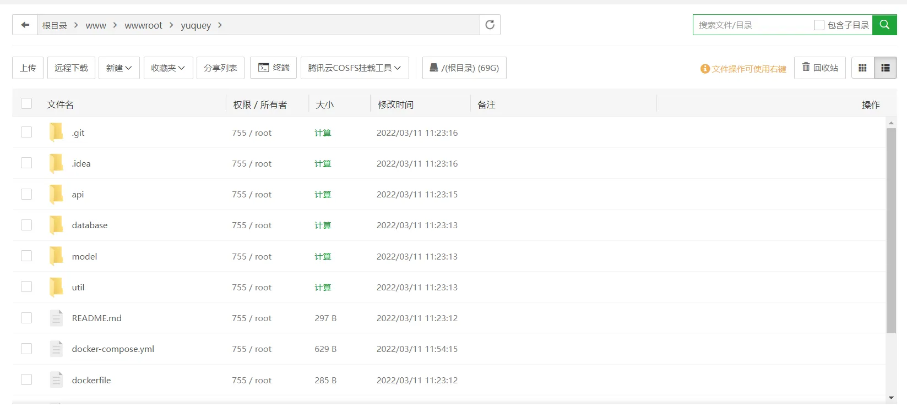
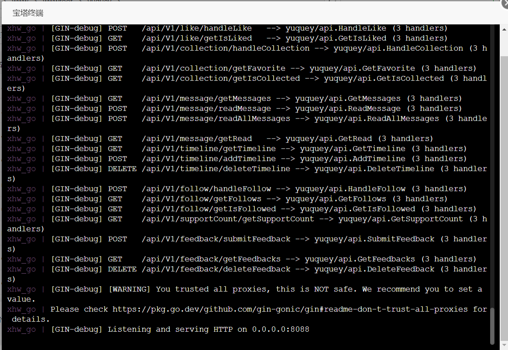

# 1. 安装 docker & docker-compose

先安装 docker，如果使用的是宝塔面板，直接进入商店下载即可

然后安装 docker-compose，直接在宝塔面板的终端运行下面这行代码

```bash
curl -L https://get.daocloud.io/docker/compose/releases/download/1.29.2/docker-compose-`uname -s`-`uname -m` > /usr/local/bin/docker-compose

# 如果上面这条不行，就运行下面这条之后再试
chmod +x /usr/local/bin/docker-compose

# 检查版本确认安装完成
docker-compose --version

# 如果以上操作报错需要重新操作，需清空原数据
docker volume rm yuquey_pg-data
```

# 2. 准备 Go 后端文件

在宝塔面板目录下，放入完整后端项目



# 3. 配置 docker 相关文件

## dockerfile

```dockerfile
# 镜像系统
FROM golang:alpine

# 定义路径
ENV GO111MODULE=on
ENV GOPROXY=https://goproxy.cn,direct

# 进入容器时的路径
WORKDIR /build
COPY . .

RUN go build -o app .

# 声明服务端口
EXPOSE 8088

# 启动容器时运行的命令
CMD ["/build/app"]
```

## database.go

```go
// 以postgres数据库为例
const postgresHost = "xhw_postgres"

var err error
psgInfo := fmt.Sprintf("host=%s user=%s port=%s password=%s dbname=%s sslmode=disable",postgresHost, "postgres", "5432", "pgsql1101", "postgres")
DB, err = gorm.Open("postgres", psgInfo)
DB.LogMode(true)
if err != nil {
    panic("failed to connect database, err:" + err.Error())
}
```

## docker-compose.yml

```yaml
version: "3.7"

services:
pg:
image: postgres:alpine  # 基础镜像
container_name: "xhw_postgres"  # 容器名称
ports:
- "5432:5432"
volumes:
- pg-data:/var/lib/postgresql/data  # 数据卷挂载
environment:
- POSTGRES_DB=postgres  # 数据库名
- POSTGRES_USER=postgres  # 数据库用户
- POSTGRES_PASSWORD=pgsql1101  # 数据库密码
go:
container_name: "xhw_go"
build: .  # Dockerfile文件目录
restart: always
ports:
- "8088:8088"
links:
- pg
depends_on:
- pg

volumes: # 数据卷
pg-data:
```

注意：docker-compose.yml 里的数据库信息与 database.go 里的信息需一致

# 4. 创建容器

在后端文件夹目录下打开终端，运行

```bash
docker-compose up
```

这个过程比较长，如果正常运行完，会显示监听 0.0.0.0:8088（示例）。如果运行报错，会显示 exit code 2，并提示报错信息



# 5. nginx 反向代理

为了方便前端的使用，在网站的配置文件中，加入下面这条，实现前端请求的反向代理

```
location /go/ {
  proxy_pass http://127.0.0.1:8088/api/V1/;
}
```
