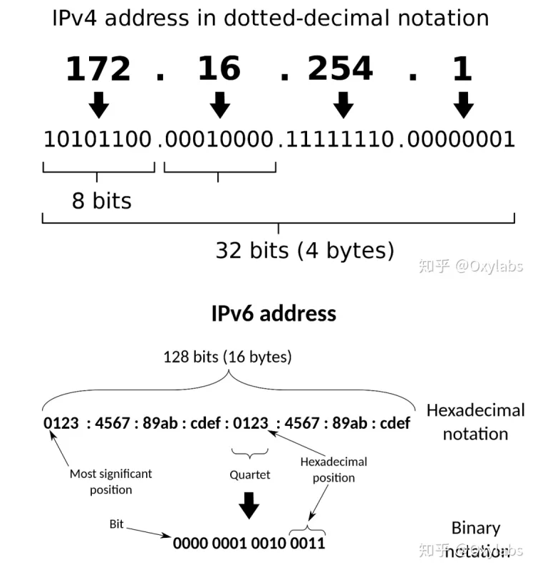

# JavaScript

## 1 数据类型

- 基本数据类型
  - null
  - undefined
  - boolean
  - number
  - string
  - symbol
  - bigint
- 引用数据类型
  - Object

```tsx
typeof 42; // "number"
typeof "s"; // "string"
typeof true; // "boolean"
typeof { a: 1 }; // "object"
typeof null; // "object" ，因为前面是000，obj的判定正好就是前面三位是000的是obj
typeof somethingUndefined; // "undefined"
```

## 2 渲染 & 重排 & 重绘

### 2.1 渲染

1. 浏览器将获取的 HTML 文档并解析成 DOM 树。
2. 处理 CSS 标记，构成层叠样式表模型 CSSOM(CSS Object Model)。
3. 将 DOM 和 CSSOM 合并为渲染树(rendering tree)将会被创建，代表一系列将被渲染的对象。
4. 渲染树的每个元素包含的内容都是计算过的，它被称之为布局 layout。浏览器使用一种流式处理的方法，只需要一次 pass 绘制操作就可以布局所有的元素。
5. 将渲染树的各个节点绘制到屏幕上，这一步被称为绘制 painting。

### 2.2 重排 Reflow

当 rendering tree 中的一部分(或全部)因为元素的规模尺寸，布局，隐藏等改变而需要重新构建。这就称为重排。每个页面至少需要一次重排，就是在页面第一次加载的时候，这时候是一定会发生重排的，因为要构建 render tree。在重排的时候，浏览器会使渲染树中受到影响的部分失效，并重新构造这部分渲染树，完成重排后，浏览器会重新绘制受影响的部分到屏幕中，该过程成为重绘。

### 2.3 重绘

当 rendering tree 中的一些元素需要更新属性，而这些属性只是影响元素的外观，风格，而不会影响布局的，比如 background-color。则就叫称为重绘。
重排必重绘~

## 3 防抖和节流

### 3.1 防抖

对于短时间内连续触发的事件（上面的滚动事件），防抖的含义就是让某个时间期限（如上面的 1000 毫秒）内，事件处理函数只执行一次。

> 【回城】就是一直拖就一直不执行，结束才执行

```tsx
function debounce(func, wait) {
    let timeout; // 用于存储定时器的标识符

    // 返回一个新的函数
    return function (...args) {
        const context = this; // 保存调用时的上下文

        // 每次触发时，清除之前的定时器
        clearTimeout(timeout);

        // 设置一个新的定时器
        timeout = setTimeout(() => {
            func.apply(context, args); // 在定时器结束后执行目标函数
        }, wait);
    };
}
```

### 3.2 节流

如果短时间内大量触发同一事件，那么在函数执行一次之后，该函数在指定的时间期限内不再工作，直至过了这段时间才重新生效。

> 【普通攻击】一直拖，中间执行一次，过段时间再执行下一次

## 4 Promise

### 4.1 简介

promise 有三种状态

- pending：未决
- resolve：成功
- reject：拒绝

then 和 catch 都有 reject 的时候，优先调用 then，then 没有就用 catch 的 reject

### 4.2 基础 demo

```javascript
// then中的onfulfilled,onReject回调是异步执行的
new Promise(function (resolve, reject) {
  // 未决部分代码，直接执行
  console.log(1);
  // 在合适的时间，将任务推向已决
  resolve(3); // 推向已决，并附带数据 3
}).then(
  function (value) {
    //onfulfilled函数
    console.log(value);
  },
  function (err) {
    //onReject函数
    console.log(reason);
  }
);
console.log(2);

// 打印结果
1;
2;
3;
```

### 4.3 常见问题

Q：promise 链式调用，后面状态是如何改变的？
A：通过 return 和 throw error

Q：then 里面，如果原来是 rejected，加一个什么处理可以变成 resolved？
A：在 rejected 调用函数中 return 1 即可

Q：通过 promise.rejected 构造一个返回 rejected 状态的方法？
A：throw error

### 4.4 fetch 的超时模拟

```javascript
function myFetch(timeout) {
  // 通过setTimeout模拟封装fetch
  const fetch = () => {
    return new Promise((resolve, reject) => {
      setTimeout(() => {
        resolve("ok");
      }, 3 * 1000);
    });
  };

  return new Promise((resolve, reject) => {
    // 模拟fetch，运行成功则resolve
    fetch().then(() => {
      resolve("ok");
    });
    // 模拟超时，超时则reject
    setTimeout(() => {
      reject("timeout");
    }, timeout * 1000);
  });
}

myFetch(2)
  .then((v) => {
    console.log(v);
  })
  .catch((e) => {
    console.log(e);
  });
```

## 5 宏/微任务执行顺序

```javascript
async function async1() {
  console.log("async1 start");
  await async2();
  console.log("async1 end");
}
async function async2() {
  console.log("async2");
}

console.log("script start");
setTimeout(() => {
  console.log("setTimeOut");
}, 0);
async1();
new Promise(function (resolve) {
  console.log("promise1");
  resolve();
}).then(function () {
  console.log("promise2");
});
console.log("script end");
```

**流程**

1. 整个代码片段（script）作为一个宏任务执行 console.log('script start')，输出 script start；
2. 执行 setTimeout，是一个异步动作，放入宏任务异步队列中；
3. 执行 async1()，输出 async1 start，继续向下执行；
4. 执行 async2()，输出 async2，并返回了一个 promise 对象，await 让出了线程，把返回的 promise 加入了微任务异步队列，所以 async1()下面的代码也要等待上面完成后继续执行;
5. 执行 new Promise，输出 promise1，然后将 resolve()放入微任务异步队列；
6. 执行 console.log('script end')，输出 script end；
7. 到此同步的代码就都执行完成了，然后去微任务异步队列里去获取任务
8. 接下来执行 resolve（async2 返回的 promise 返回的），输出了 async1 end；
9. 然后执行 resolve（new Promise 的），输出了 promise2；
10. 最后执行 setTimeout，输出了 setTimeout。

```javascript
// 宏1
script start
async1 start
async2
promise1

// 微
script end
async1 end
promise2

// 宏2
setTimeOut
```

## 6 原型 & 原型链

```javascript
function Person() {
  var person = new Person();
  console.log(person.__proto__ === Person.prototype); //true
  console.log(Person.prototype.constructor === Person); //true
}
```


## 7 闭包

内部函数总是可以访问其所在的外部函数（下面的 a）中声明的参数和变量，即便外部函数被返回

```javascript
function a() {
  var i = 0; // 这个就是外面还想访问的变量，不会因a的return就被清理
  function b() {
    alert(++i); // 这里调用外部函数的变量
  }
  return b; // 这里如果不返回b，则ab互相引用，与外界无关，则ab被回收
}
var c = a(); // 事实上是返回（调用）b
c(); // 显示++i
```

- 作用：让外部访问函数内部变量成为可能，且该局部变量常驻内存，不被清理,可以避免使用全局变量，防止全局变量污染
- 缺点：内存泄漏，一块内存空间被长期占用不释放
- 实际case：例如在setTimeout或者setInterval中，使用外部state，就存在闭包问题，会导致每次使用的都是初始情况的快照，而不是最新值

## 8 this

对于函数而言，指向最后调用函数的那个对象，是函数运行时内部自动生成的一个内部对象，只能在函数内部使用；
对于全局而言，this 指向 window。
箭头函数下 this 指向外层最近对象

## 9 柯里化

```javascript
add(1)(2)(3):

function add(a){
  const tmp = function(b){
    return add(a + b)
  }
  tmp.toString = function(){
    return a
  }
  return tmp
}
```

## 10 addEventListen

- event：指定事件名：不要使用"on"前级。例如，使用"click",而不是使用"onclick"
- function：指定要事件触发时执行的函数
- useCapture：boolean，指定事件是否在捕获或冒泡阶段执行

## 11 ES6 新特性

```javascript
// 1
let const
// 块级作用域：var没有块的概念，let const有，即跨块不能访问别处变量
// 暂时性死区
console.log(a) // undefined
var a
console.log(b) // ReferenceError: b is not defined
let b

// 2
str.includes()

// 3 重复
str.repeat()
'x'.repeat(3) // 'xxx'

// 4
str.replaceAll('a', 'b')
'apple'.replaceAll('a', 'b')

// 5 去除小数
Math.trunc(4.12) // 4

// 6 立方根
Math.cbrt(2) // 1.2....

// 7 数组扩展spread
...[1, 2, 3] // 1, 2, 3
...'abc' // ['a', 'b', 'c']

// 8 复制数组
a2 = a1 // a2改则a1改，本质是直接把指针给了a2
a2 = a1.concat() // 如果真的想单纯复制就这样

// 9 for...of
for (let i of [1, 2, 3].values()) // 1,2,3

// 10 flat 拉平
[1, 2, [3, [4, 5]]].flat() // [1, 2, 3, [4, 5]]

// 11 arr.map
[1, 2, 3].map(x => x * x); // 1, 4, 9
```

## 12 遍历相关 forEach/map/forIn/forOf

```javascript
objArr.forEach(function (value) {
  console.log(value);
});
// foreach 方法没办法使用 break 语句跳出循环，或者使用return从函数体内返回
```

```javascript
let array = [, 1, , 2, , 3];
array = array.map((i) => ++i); // [ , 2, , 3, , 4]

// 解释：
// 1. foreach, filter, reduce, every 和 some 都会跳过空位。
// 2. map会跳过空位，但会保留这个值
// 3. join和 toString 会将空位视为 undefined,而 undefined 和null会被处理成空字符串。
```

```javascript
for (var index in objArr) {
  console.log(objArr[index]);
}

/*
  以上代码会出现的问题：
  1.index 值 会是字符串（String）类型
  2.循环不仅会遍历数组元素，还会遍历任意其他自定义添加的属性，如，objArr上面包含自定义属性，objArr.name，那这次循环中也会出现此name属性
  3.某些情况下，上述代码会以随机顺序循环数组
*/
```

```javascript
for (let value of objArr) {
  console.log(value);
}

/*
  1.可以避免所有 for-in 循环的陷阱
  2.不同于 forEach()，可以使用 break, continue 和 return
  3.for-of 循环不仅仅支持数组的遍历。同样适用于很多类似数组的对象
  4.它也支持字符串的遍历
  5.for-of 并不适用于处理原有的原生对象
*/
```

## 13 继承

### 13.1 原型链继承

```javascript
// 将父类作为子类的原型
function Cat() {}
Cat.prototype = new Animal();
Cat.prototype.name = "cat";
// 优点：父类新增原型方法/原型属性，子类都能访问到，简单，易于实现
// 缺点：无法实现多继承，创建子类实例时，无法向父类构造函数传参
```

### 13.2 构造继承

```javascript
function Cat(name) {
  Animal.call(this);
  this.name = name || "Tom";
}
// 优点：可以实现多继承（call多个父类对象），创建子类实例时，可以向父类传递参数
// 缺点：无法实现函数复用，每个子类都有父类实例函数的副本，影响性能
```

## 14 call/apply/bind

**相同**
第一个参数都是对 this 对重定向，将函数对 this 指向传入的第一个参数
**不同**

1. bind 返回值为一个函数，需要再次调用
2. 传入参数时 apply 将所有参数打包进数组后统一传入

## 15 click 事件发生具体顺序

onmouseenter -> onmousedown -> onfocus -> onmouseup -> onclick

# CSS

## 1 CSS 盒子模型

标准模式：总宽度=width + margin(左右) + padding(左右) + border(左右)

怪异模式：总宽度= width + margin(左右)

> 即 width 已经包含了 padding 和 border 值

## 2 absolute/relative

1. **文档流不同**

relative 不脱离文档流，absolute 脱离文档流。

2. **分级不同**

relative 参考自身静态位置通过 top, bottom, left, right 定位，并且可以通过 z-index 进行层次分级。
absolute 通过 top,bottom,left,right 定位。选取其最近的父级定位元素，当父级 position 为 static 时，absolute 元素将以 body 坐标原点进行定位，可以通过 z-index 进行层次分级。

3. **定位不同**

absolute 是绝对定位,绝对定位就是相对于父元素的定位,不受父元素内其他子元素的影响;而 relative 是相对定位,相对定位是相对于同级元素的定位,也就是上一个同级元素。

## 3 纯 CSS 画三角形

```css
#triangle-up {
  width: 0;
  height: 0;
  border-left: 50px solid transparent;
  border-right: 50px solid transparent;
  border-bottom: 100px solid red;
}
```

```css
#triangle-left {
  width: 0;
  height: 0;
  border-top: 50px solid transparent;
  border-right: 100px solid red;
  border-bottom: 50px solid transparent;
}
```

```css
#triangle-topleft {
  width: 0;
  height: 0;
  border-top: 100px solid red;
  border-right: 100px solid transparent;
}
```

## 4 px/em/rem

- px：px 是固定的像素，一旦设置了就无法因为适应页面大小而改变
- em：相对于父元素
- rem：相对于根元素

## 5 inline 元素的无效属性

1. inline 元素设置 width，height 属性无效
2. inline 元素的 padding 和 margin 可以设置，但是水平方向的 padding-right，padding-left，margin-right，margin-left 都产生了效果，而垂直方向的 padding-top，padding-bottom，margin-bottom，margin-top 是没有效果的

## 6 隐藏元素方法

**display: none**
如果给一个元素设置了 display: none，那么该元素以及它的所有后代元素都会隐藏，**占据的空间消失**。
**visibility: hidden**
给元素设置 visibility: hidden 也可以隐藏这个元素，但是隐藏元素**仍需占用**与未隐藏时一样的空间，也就是说虽然元素不可见了，但是仍然会影响页面布局。
**opacity: 0**
透明度完全透明，但是同样**占位**

## 7 BFC

BFC (Block Formatting Context)块格式化上下文，是 Web 页面的可视 CSS 渲染的一部分，是块盒子的布局过程发生的区域,也是浮动元素与其他元素交互的区域。
就是页面上的一个隔离的独立容器，**容器里面的子元素不会影响到外面的元素**。我们经常使用到 BFC,只不过不知道它是 BFC 而已。
如何创建一个 BFC？

- 浮动元素(元素的 float 不是 none，指定 float 为 left 或者 right 就可以创建 BFC)
- 绝对定位元素(元素的 position 为 absolute 或 fixed )
- display:inline-block，display:table-cell, display:flex, display:inline-flex
- overflow 指定除了 visible 的值

## 8 怎么给页面内所有元素加上 border

```javascript
document.querySelectorAll("*").forEach(function (el) {
  // 排除某些元素
  if (!el.classList.contains("no-border")) {
    el.style.border = "1px solid black";
  }
});
```

# HTTP

## 1 网址栏输入地址之后具体会发生什么？

1. DNS 域名解析（参见下方 2）
2. 发起 TCP 的三次握手（参见下方 3）
3. 建立 TCP 连接后发起 HTTP 请求
4. 服务器响应 HTTP 请求，浏览器得到 HTML 代码
5. 浏览器解析 HTML 代码，并请求 HTML 代码中的资源，如 JS、CSS、图片等（参见JS部分2.1渲染）
6. 浏览器对页面进行渲染呈现给用户

## 2 DNS 域名解析

1. 浏览器先检查**自身缓存**中有没有被解析过的这个域名对应的 ip 地址，如果有，解析结束。同时域名被缓存的时间也可通过 TTL 属性来设置。
2. 如果浏览器缓存中没命中，浏览器会检查**操作系统缓存**中有没有对应的已解析过的结果。

   > 而操作系统也有一个域名解析的过程。在 windows 中可通过 c 盘里一个叫 hosts 的文件来设置，如果你在这里指定了一个域名对应的 ip 地址，那浏览器会首先使用这个 ip 地址。

3. 如果至此还没有命中域名，才会真正的请求**本地域名服务器**（LDNS）来解析这个域名，这台服务器一般在你的城市的某个角落，距离你不会很远，并且这台服务器的性能都很好，一般都会缓存域名解析结果，大约 80%的域名解析到这里就完成了。
4. 如果 LDNS 仍然没有命中，就直接跳到**Root Server 域名服务器**请求解析
5. 根域名服务器返回给 LDNS 一个所查询域的**主域名服务器**（gTLD Server，国际顶尖域名服务器，如.com .cn .org 等）地址
6. 此时 LDNS 再发送**请求**给上一步返回的 gTLD
7. 接受请求的 gTLD 查找并返回这个域名对应的 Name Server 的地址，这个 Name Server 就是网站注册的域名服务器
8. Name Server 根据映射关系表找到目标 ip，返回给 LDNS
9. LDNS 缓存这个域名和对应的 ip
10. LDNS 把解析的结果返回给用户，用户根据 TTL 值缓存到本地系统缓存中，域名解析过程至此结束

## 3 三次握手

### 过程

1. 客户端发送到服务器。客户端发送 SYN 报文给服务器，并且指明客户端初始化序列号为 ISN(c)，即以 SYN=1, seq=x 的形式发送过去。此时客户端处于 SYN_SEND 状态。
2. 服务器发送给客户端。服务器收到客户端的 SYN 和 ISN(c)，也发送一个 SYN 回去，同时设置 ACK = ISN(c) + 1 以及指明服务器初始化序列号为 ISN(s)，即以 SYN=1, ACK=x+1， seq=y 的形式发送给客户端。
3. 客户端发送到服务器。客户端收到服务器发送的消息后，设置 ACK = ISN(s) + 1，将自身的 ISN(c) + 1，即以 ACK=y+1, seq=x+1 的形式发送给服务器。此时客户端处于 ESTABLISHED 阶段，服务器收到报文，也处于 ESTABLISHED 阶段，双方建立了连接。


### 目的

1. 客户端发送数据给服务器，服务器确认自己可以接受客户端的请求。
2. 服务器发送数据给客户端，客户端确认自己可以发送数据给服务器，也可以接受到服务器的请求。
3. 客户端发送数据给服务器，服务器确认自己可以发送数据给客户端。

如果采用两次握手，客户端发送数据给服务器，服务器确认后就当连接开始：

1. 客户端发送一次请求给服务器……指定时间后没响应再发了一个
2. 服务器先接收到后一个建立连接的请求，然后前一个建立连接的请求，因为网络延迟等问题，在第二个之后达到了
3. 服务器认为第二个请求是最新发的，于是向客户端发送确认报文段，同意建立连接，于是连接建立了（两次握手）
4. 这时候客户端还在等待最新的请求连接（第二次请求），自动忽略服务器发送的关于第一个请求连接的响应，也不发送数据
5. 服务器一直等待客户端发送数据，服务器资源被占用
   > 客户端 -> 1 -> 服务器
   > 客户端 -> 2 -> 服务器
   > 服务器 get 2
   > 服务器 get 1
   > 服务器 reply 1
   > 客户端 wait 2
   > gg

## 4 四次挥手

1. 客户端发送给服务器。客户端以 FIN=1, seq=u 的形式发送给服务器，表示需要关闭客户端和服务器的数据传输。此时客户端处于 FIN_WAIT 状态。
2. 服务器发送给客户端。服务器收到信息，先返回 ACK 给客户端，即以 ACK=1, seq=v, ack=u+1 的形式返回给客户端，表示收到客户端报文了。此时服务器处于 CLOSE_WAIT 状态。
3. 服务器发送给客户端。服务器等待一会，看客户端还有没有数据没发过来，等处理完这些数据之后，也想断开连接了，于是发送 FIN 给客户端，即以 FIN=1, ACK=1, seq=w, ack=u+1 的形式发送给客户端。此时服务器处于 LAST_ACK 状态。
4. 客户端发送给服务器。客户端收到 FIN 之后，返回 ACK 报文作为应答，即以 ACK=1, seq=w+1 的形式发送给服务器。此时客户端处于 TIME_WAIT 状态。


其中，ESTABLISHED 表示正在通信，TIME_WAIT 表示主动关闭，CLOSE_WAIT 表示被动关闭。

## 5 状态码

### 5.1 Status Code

**1xx** 指示信息-表示请求已接收

- 101 Switching Protocols:在 HTTP 升级为 WebSocket 的时候，如果服务器同意变更，就会发送状态码为 101。

**2xx** 请求成功-表示请求成功接收并解析

- 200 OK:请求成功状态码，响应体中含有数据。
- 204 No Content:含义同 200，但是响应报文不含实体的主体部分。
- 206 Partial Content:表示部分内容请求成功。使用场景为 HTTP 分块下载和断点续传，当然也会带上相应的响应头字段 Content-Range

**3xx** 重定向-表示要完成请求需要更进一步操作

- 301 Move Permanently:永久重定向。HTTP 升级 HTTPS，之前站点再也不用，那就是 301。
- 302 Found:临时重定向。当前站点暂时不可用，那就是 302，后续可能换回来。
- 304 Not Modified:当命中协商缓存时会返回这个状态码。

**4xx** 客户端错误-请求有语法错误或者请求无法实现

- 400 Bad Request:请求无效。通常为前后端数据格式不一致或者其他原因。
- 403 Forbidden:服务器已经得到请求，但是拒绝执行，比如没权限、法律禁止等。
- 404 Not Found:资源未找到，服务器不存在对应的资源。

**5xx** 服务端错误-服务端未能实现合法的请求

- 500 Internal Server Error: 服务器报错，有些时候可以在 Response 看到后端 PHP 等技术的报错信息等。
- 502 Bad Gateway:服务器正常，但是访问出错。
- 503 Service Unavailable:服务器繁忙或者停机维护，暂时无法处理请求。

### 5.2 ReadyState

0：未初始化，还没有调用 send()方法
1：载入，已调用 send()方法，正在发送请求
2：载入完成，send()方法执行完成，已经接收到全部响应内容
3：交互，正在解析响应内容
4：完成，响应内容解析完成，可以在客户端进行调用

## 6 跨域

### 6.1 同源策略

出于浏览器的同源策略限制。同源策略（SameOriginPolicy）是一种约定，它是浏览器最核心也最基本的安全功能，如果缺少了同源策略，则浏览器的正常功能可能都会受到影响。可以说 Web 是构建在同源策略基础之上的，浏览器只是针对同源策略的一种实现。同源策略会阻止一个域的 javascript 脚本和另外一个域的内容进行交互。

### 6.2 跨域

所谓同源（即指在同一个域）就是两个页面具有相同的协议（protocol），主机（host）和端口号（port）。而当三者有一个不一样时，两个资源就不在一个域中。

### 6.3 如何解决

1. JSONP (JSON with Padding)：JSONP 是一种早期的跨域解决方案，它利用了`<script>`标签可以跨域加载资源的特性。通过动态创建`<script>`标签，将回调函数名和数据一起发送到服务器，服务器返回一个 JavaScript 函数调用，将数据作为参数传入。

2. CORS (Cross-Origin Resource Sharing)：CORS 是现代浏览器支持的跨域方式，通过设置 HTTP 响应头Access-Control-Allow-Origin来允许特定的跨域请求。服务器可以在响应头中添加以下代码或指定特定域名。

   ```tsx
   // 允许所有来源
   Access-Control-Allow-Origin: *
   ```

3. 代理服务器：在开发环境中，可以使用代理服务器（如 Webpack Dev Server、 NGINX、Apache 等）转发请求，将原本需要跨域的请求转发到同源的服务器上，从而避免跨域问题。

4. Iframe：当一个页面嵌套在另一个页面的 Iframe 中时，它们之间可以互相访问。通过在父页面和子页面之间通信，实现跨域数据交换。

## 7 TCP

### 7.1 TCP & UDP

|              | UDP（User Datagram Protocol）               | TCP（Transmission Control Protocol）   |
| ------------ | ------------------------------------------- | -------------------------------------- |
| 是否连接     | 无连接                                      | 面向连接                               |
| 是否可靠     | 不可靠传输，不使用流量控制和拥塞控制        | 可靠传输，使用流量控制和拥塞控制       |
| 连接对象个数 | 支持一对一，一对多，多对一和多对多交互通信  | 只能是一对一通信                       |
| 传输方式     | 面向报文                                    | 面向字节流                             |
| 首部开销     | 首部开销小，仅 8 字节                       | 首部最小 20 字节，最大 60 字节         |
| 适用场景     | 适用于实时应用（ip 电话，视频会议，直播等） | 适用于要求可靠传输的应用，例如文件传输 |

### 7.2 丢包处理

1. 重传机制：TCP 使用序列号来标识数据包，当接收方发现数据包的序列号不连续时，它会发送一个选择性确认（SACK）或重复确认（DUP ACK），告知发送方哪些数据包丢失了。发送方在收到这些确认后，会重新发送丢失的数据包。
2. 滑动窗口：TCP 使用滑动窗口机制来控制数据的发送速率。当丢包发生时，发送方会减少其窗口大小，从而降低发送速率，以避免网络拥塞。
3. 快速重传：当发送方连续收到三个相同的选择性确认时，它会立即重传丢失的数据包，而不是等待重传计时器超时。

### 7.3 TCP 粘包现象

**概念**

发送方发送的若干包数据到接收方接收时粘成一包，从接收缓冲区看，后一包数据的头紧接着前一包数据的尾。

**原因**

1. 发送方原因：TCP 默认会使用 Nagle 算法。而 Nagle 算法主要做两件事：
   1. 只有上一个分组得到确认，才会发送下一个分组；
   2. 收集多个小分组，在一个确认到来时一起发送。


2. 接收方原因：TCP 接收到分组时，并不会立刻送至应用层处理，或者说，应用层并不一定会立即处理；实际上，TCP 将收到的分组保存至接收缓存里，然后应用程序主动从缓存里读收到的分组。这样一来，如果 TCP 接收分组的速度大于应用程序读分组的速度，多个包就会被存至缓存，应用程序读时，就会读到多个首尾相接粘到一起的包。

**解决**

1. 关闭 Nagle 算法
2. 解决方法就是循环处理：应用程序在处理从缓存读来的分组时，读完一条数据时，就应该循环读下一条数据，直到所有的数据都被处理；但是如何判断每条数据的长度呢？
   1. 格式化数据
   2. 发送长度

### 7.4 窗口滑动协议


**慢启动**

CWND 一开始比较小，后面指数变大。慢启动算法的理由是，TCP 模块刚开始发送数据时并不知道网络的实际情况，需要用一种试探的方式平滑地增加 CWND 的大小。

**拥塞避免算法**

拥塞避免算法是的 CWND 按照线性增长方式增加，从而减缓了其扩大。

**快速重传**

当接收端收到报文段的顺序不符合序号，即在两个报文段之间的报文段没收到，就会立即发送三条重复确认报文，接收方收到三条重复的确认报文段后，就立即重传确认报文段后面的报文

**快恢复**

快恢复的执行就是将 SSThreshold 设置为减半的大小。也有的快恢复算法再开始时会将 CWND 值再增大一些，即等于 SSThreshold + 3 × MSS。理由是：既然发送方收到三个重复的确认，就表明有三个分组已经离开了网络。这三个分组不再消耗网络资源而是停留在接收方的缓存中。可见现在网络中并不是堆积了分组而是减少了三个分组。因此可以适当把拥塞窗口增大些。

## 8 简单请求/预检请求

### 8.1 简单请求

请求方法是以下三种方法之一：

- HEAD
- GET
- POST

HTTP 的头信息不超出以下几种字段:

- Accept
- Accept-Language
- Content-Language
- Last-Event-ID
- Content-Type：只限于三个值
  - application/x-www-form-urlencoded
  - multipart/form-data
  - text/plain

### 8.2 预检请求

其他就是复杂/预检请求

### 8.3 content-type 常用值

**multipart/form-data**
需要在表单中进行文件上传时，就需要使用该格式。常见的媒体格式是上传文件之时使用的 这个常用于文件上传 我用得最多就是图片上传的时候。
**application/x-www-form-urlencoded**
数据被编码为名称/值对。这是标准的编码格式 这个其实是 form 表单默认的 post 请求时发送的数据格式。也就是 form 表单 post 请求，你不设置 content-type 属性，它自动会使用这个。
**application/json**
消息主体是序列化后的 JSON 字符串
**text/plain**
正常文本

## 9 IPv4 & IPv6

> IP == Internet Protocol == Internet 协议

IPv4 和 IPv6 是不同类型的 IP 地址。它们的主要用途相同，标记不同的用户，并且让用户能通过 IP 进行通信。主要区别在于 IPv6 是最新一代的 IP 地址。



IPv4 地址的概念是在 1980 年代初期提出的。即使有新版本的 IP 地址，IPv4 地址仍然是 Internet 用户使用最广泛的地址。通常，IPv4 地址以点分十进制表示。每个部分代表一组构成 8 位地址方案的 8 位地址。

IPv6 地址并不是一种全新的技术。它是 Internet 协议的最新版本，但它是在 1998 年开发的，旨在替换 IPv4 地址。IPv6 地址使用以冒号分隔的十六进制数字。它分为八个 16 位块，构成一个 128 位地址方案。

值得注意的是，只有 IPv4 可以进行内网穿透，下面是 ipv4 的地址划分

**A 类**
地址范围：1.0.0.1-126.255.255.254
默认子网掩码：255.0.0.0
A 类第 1 位必须是 0。
**B 类**
地址范围：128.1.0.1-191.255.255.254
默认子网掩码：255.255.0.0
前两位固定为 10。
**C 类**
地址范围：192.0.1.1-223.255.255.254
子网掩码：255.255.255.0
前 3 位固定为 110。
**D 类**
地址范围：224.0.0.1-239.255.255.254
**E 类**
是保留地址。该类 IP 地址的最前面为“1111”，所以地址的网络号取值于 240~255 之间。

> 每一个字节都为 0 的地址（0.0.0.0）对应当前主机。
> IP 地址中的每一个字节都为 1 的 IP 地址（255.255.255.255）是当前子网的广播地址。
> 子网掩码作用：子网掩码的作用是通过划分 IP 地址减少网络流量、提高网络性能、扩大地理范围。

## 10 当 ping 一个 IP 地址时发生了什么

当你 ping 一个 IP 地址时，你的计算机会发送一个 ICMP（Internet Control Message Protocol）回显请求包到目标 IP 地址，并等待回显应答。
如果目标 IP 地址可达并且没有防火墙阻止 ICMP 包，你的计算机将会收到一个 ICMP 回显应答。
那怎么让一个服务器不被 ping 呢？当然是扔掉所有相关请求

```bash
iptables -A INPUT -p icmp --icmp-type echo-request -j DROP
```

## 11 jwt/access token/refresh token

**jwt**
Json web token (JWT)，是一种基于 JSON 的开放标准
1、可以避免用户信息泄露。
2、payload 中可以携带一些必要的非敏感信息，比如用户名、用户邮箱，供前端使用
3、服务端不用存放 jwt 的状态信息，减轻服务端压力,在分布式场景中更方便，不需要状态共享
4、通过时间戳的方式避免重放攻击，token 的时效性尽量短
**access token**
Access Token 应该维持在较短有效期，过长不安全，过短也会影响用户体验，因为频繁去刷新带来没有必要的网络请求。可以参考我们常常在某些网站停止操作一段时间之后就会掉线，这个时间是 Refresh Token 的有效期，Access Token 不应长过这个时间。
**refresh token**
Refresh Token 的有效期就是允许用户在多久时间内不用重新登录的时间，可以很长，视业务而定。我们在使用某些 APP 的时候，即使一个月没有开过也是登录状态的，这就是 Refresh Token 决定的。授权服务在接到 Refresh Token 的时候还要进一步做客户端的验证，尽可能排除盗用的情况。

## 12 TCP 四种定时器

**重传计时器 Retransmission Timer**
为了控制丢失的报文段或丢弃的报文段，也就是对报文段确认的等待时间。当 TCP 发送报文段时，就创建这个特定报文段的重传计时器，可能发生两种情况:若在计时器超时之前收到对报文段的确认，则撤销计时器;若在收到对特定报文段的确认之前计时器超时，则重传该报文，并把计时器复位;
**坚持计时器 Persistent Timer**
当发送端收到零窗口的确认时，就启动坚持计时器，当坚持计时器截止期到时，发送端 TCP 就发送一个特殊的报文段，叫探测报文段，这个报文段只有一个字节的数据。探测报文段有序号，但序号永远不需要确认，甚至在计算对其他部分数据的确认时这个序号也被忽略。探测报文段提醒接收端 TCP，确认已丢失，必须重传。
**保活计时器 Keep-Alive Timer**
每当服务器收到客户的信息，就将 keep-alive timer 复位，超时通常设置 2 小时，若服务器超过 2 小时还没有收到来自客户的信息，就发送探测报文段，若发送了 10 个探测报文段（没 75 秒发送一个）还没收到响应，则终止连接。
**时间等待计时器 Time_Wait Timer**
在连接终止期使用，当 TCP 关闭连接时，并不认为这个连接就真正关闭了，在时间等待期间，连接还处于一种中间过渡状态。这样就可以时重复的 FIN 报文段在到达终点后被丢弃，这个计时器的值通常设置为一格报文段在·寿命期望值的两倍。

## 13 HTTP 迭代

**HTTP 1.0**
无状态，无连接
短连接：每次发送请求都要重新建立 tcp 请求，即三次握手，非常浪费性能
无 host 头域，也就是 http 请求头里的 host，
不允许断点续传，而且不能只传输对象的一部分，要求传输整个对象
**HTTP 1.1**
长连接，流水线，使用 connection:keep-alive 使用长连接
请求管道化
增加缓存处理（新的字段如 cache-control）
增加 Host 字段，支持断点传输等
由于长连接会给服务器造成压力
**HTTP 2.0**
二进制分帧
头部压缩，双方各自维护一个 header 的索引表，使得不需要直接发送值，通过发送 key 缩减头部大小
多路复用（或连接共享），使用多个 stream，每个 stream 又分帧传输，使得一个 tcp 连接能够处理多个 http 请求
服务器推送（Sever push）
**HTTP 3.0**
基于 google 的 QUIC 协议，而 quic 协议是使用 udp 实现的
减少了 tcp 三次握手时间，以及 tls 握手时间
解决了 http 2.0 中前一个 stream 丢包导致后一个 stream 被阻塞的问题
优化了重传策略，重传包和原包的编号不同，降低后续重传计算的消耗
连接迁移，不再用 tcp 四元组确定一个连接，而是用一个 64 位随机数来确定这个连接
更合适的流量控制

## 14 websocket/HTTPS

**websocket**
Websocket 通过 HTTP/1.1 协议的 101 状态码进行握手。
比较新的技术去做轮询的效果是 Comet。这种技术虽然可以双向通信，但依然需要反复发出请求。而且在 Comet 中，普遍采用的长链接，也会消耗服务器资源。在这种情况下，HTML5 定义了 WebSocket 协议，能更好的节省服务器资源和带宽，并且能够更实时地进行通讯。
**HTTPS**
Hyper Text Transfer Protocol over SecureSocket Layer
是以安全为目标的 HTTP 通道，在 HTTP 的基础上通过传输加密和身份认证保证了传输过程的安全性 。HTTPS 在 HTTP 的基础下加入 SSL，HTTPS 的安全基础是 SSL，因此加密的详细内容就需要 SSL。 HTTPS 存在不同于 HTTP 的默认端口及一个加密/身份验证层（在 HTTP 与 TCP 之间）。
HTTPS 建立过程：

1. 客户端发起连接，同时传入自己支持的加密算法
2. 服务端发送证书，和自己的算法（私钥）进行比对，如果不符合，直接断开连接；如果符合，将 SSL 证书发送给客户端
3. 客户端验证服务端发来的证书，当证书受信之后，浏览器会随机生成一串密码，并使用证书中的公钥加密。之后就是使用约定好的哈希算法握手消息，并生成随机数对消息进行加密，再将生成的信息发送给服务器
4. 服务端接收随机数加密的信息，并解密得到随机数，验证握手信息是否被篡改，然后服务器会使用密码加密新的握手信息，发送给客户端
5. 客户端验证服务端发送回来的握手信息，完成握手

## 15 HTTP 缓存


http 缓存指的是: 当客户端向服务器请求资源时，会先抵达浏览器缓存，如果浏览器有“要请求资源”的副本，就可以直接从浏览器缓存中提取而不是从原始服务器中提取这个资源。
常见的 http 缓存只能缓存 get 请求响应的资源，对于其他类型的响应则无能为力，所以后续说的请求缓存都是指 GET 请求。
http 缓存都是从第二次请求开始的。第一次请求资源时，服务器返回资源，并在 response header 头中回传资源的缓存参数；第二次请求时，浏览器判断这些请求参数，命中强缓存就直接 200，否则就把请求参数加到 request header 头中传给服务器，看是否命中协商缓存，命中则返回 304，否则服务器会返回新的资源。

如何清除 http 缓存

```javascript
<%
response.setHeader("Pragma", "no-cache");
response.setHeader("Cache-Control", "no-cache");
response.setDateHeader("Expires", 0);
%>
```


Cookie 过期时间设置为 0，表示跟随系统默认，其销毁与 Session 销毁时间相同，即都在浏览器关闭后的特定时间删除。如果我们写程序的时候不设置 Cookie 的有效时间，那么，Cookie 的有效时间等效于会话时间

## 17 计网模型 7/5/4

**OSI 参考模型**
（物联网淑慧试用）

- 应用层
- 表示层
- 会话层
- 传输层
- 网络层
- 数据链路层
- 物理层

**TCP/IP 四层模型**

- 应用层
- 传输层
- 网际层
- 网络接口层

**TCP/IP 五层模型**

- 应用层：支持各种网络应用
- 传输层：进程-进程的数据传输
- 网络层：源主机到目的主机的数据分组路由与转发
- 数据链路层：把网络层传下来的数据报组装成帧
- 物理层

## 18 ARP 协议

**概念**
地址解析协议，即 ARP（Address Resolution Protocol），是根据 IP 地址获取物理地址的一个 TCP/IP 协议。
**工作过程**

> 主机 A 的 IP 地址为 192.168.1.1，MAC 地址为 0A-11-22-33-44-01；
> 主机 B 的 IP 地址为 192.168.1.2，MAC 地址为 0A-11-22-33-44-02；

1. 根据主机 A 上的路由表内容，IP 确定用于访问主机 B 的转发 IP 地址是 192.168.1.2。然后 A 主机在自己的本地 ARP 缓存中检查主机 B 的匹配 MAC 地址。
2. 如果主机 A 在 ARP 缓存中没有找到映射，它将询问 192.168.1.2 的硬件地址，从而将 ARP 请求帧广播到本地网络上的所有主机。源主机 A 的 IP 地址和 MAC 地址都包括在 ARP 请求中。本地网络上的每台主机都接收到 ARP 请求并且检查是否与自己的 IP 地址匹配。如果主机发现请求的 IP 地址与自己的 IP 地址不匹配，它将丢弃 ARP 请求。
3. 主机 B 确定 ARP 请求中的 IP 地址与自己的 IP 地址匹配，则将主机 A 的 IP 地址和 MAC 地址映射添加到本地 ARP 缓存中。
4. 主机 B 将包含其 MAC 地址的 ARP 回复消息直接发送回主机 A。
5. 当主机 A 收到从主机 B 发来的 ARP 回复消息时，会用主机 B 的 IP 和 MAC 地址映射更新 ARP 缓存。本机缓存是有生存期的，生存期结束后，将再次重复上面的过程。主机 B 的 MAC 地址一旦确定，主机 A 就能向主机 B 发送 IP 通信了。

# React

## 1 React & Vue

**核心**
Vue 以数据响应式为核心的 UI 框架，它的核心思想就是把所有的数据放在一个对象里面，然后当你操作对象时，对象就会改变数据，然后监听这个改变去改变 UI。
React 用一个函数来表示一个组件，当你把数据放进去时，它就会把数据渲染到组件里面，同时，在放数据的时候，要做到 "不可变"，也就是说，更新数据时，不是改变之前的数据，而是新生成一个和之前不一样的数据并放入函数，函数会得到一个新的 UI，最后更新 DOM 树。
**区别**
1、监听数据变化的实现原理不同
Vue 通过  getter/setter 以及一些函数的劫持，能精确知道数据变化。
React 默认是通过比较引用的方式（diff）进行的，如果不优化可能导致大量不必要的 VDOM 的重新渲染。为什么 React 不精确监听数据变化呢？这是因为 Vue 和 React 设计理念上的区别，Vue 使用的是可变数据，而 React 更强调数据的不可变
2、模板渲染方式的不同
在表层上，模板的语法不同，React 是通过 JSX 渲染模板。而 Vue 是通过一种拓展的 HTML 语法进行渲染，但其实这只是表面现象，毕竟 React 并不必须依赖 JSX。
3、渲染过程不同
Vue 可以更快地计算出 Virtual DOM 的差异，这是由于它在渲染过程中，会跟踪每一个组件的依赖关系，不需要重新渲染整个组件树。
React 在应用的状态被改变时，全部子组件都会重新渲染。通过 shouldComponentUpdate 这个生命周期方法可以进行控制，但 Vue 将此视为默认的优化。
4、框架本质不同
Vue 本质是 MVVM 框架，由 MVC 发展而来；
React 是前端组件化框架，由后端组件化发展而来。
**相同**

1. 使用 Virtual DOM（虚拟 DOM）
2. 提供了响应式 (Reactive) 和组件化 (Composable) 的视图组件。
3. 将注意力集中保持在核心库，而将其他功能如路由和全局状态管理交给相关的库。

## 2 fiber 架构

### 2.1 简介

React Fiber 是 React 团队为了解决老版本 React（被称为 React Stack）中存在的一些性能和渲染问题而开发的一个重构计划。这个架构的核心目标是提高 React 应用的响应性和灵活性。

### 2.2 特性

**异步更新**
在老版本的 React 中，更新是同步进行的，这可能导致应用在执行大量更新时出现卡顿。React Fiber 引入了异步更新机制，允许浏览器在更新过程中有机会重新获得控制权，从而提高应用的响应性。
**时间切片**
React Fiber 通过时间切片技术，将长时间的渲染任务分割成小块，每次只执行一小段时间的渲染工作，然后让出控制权给浏览器，这样就可以避免长时间的帧阻塞。
**优先级**
在 Fiber 架构中，React 可以根据任务的类型和紧急程度分配不同的优先级，允许更紧急的任务（如用户输入处理）优先执行。
此处跟新增特性并发渲染有关，也是这次新增了两个新的 Hooks： useTransition 和 useDeferredValue
**改进的组件生命周期**
React 16 引入了新的生命周期方法（如 getDerivedStateFromProps 和 getSnapshotBeforeUpdate），以替代老版本中的生命周期方法，这些新方法与 Fiber 架构协同工作，提供了更一致和可预测的行为。

### 2.3 快照渲染 Snapshot Rendering

快照渲染通常是指在异步渲染过程中，React 保存了渲染开始前的 UI 状态。这样做可以确保即使在渲染被分割成多个小块后，最终渲染的 UI 与同步渲染时的**结果保持一致**，如果在异步渲染过程中发生错误，React 可以使用快照状态来**恢复渲染过程**，而不是完全失败
快照会存储哪些内容？

- DOM 节点：当前渲染的 DOM 元素和属性。
- 组件状态：组件的内部状态，包括 Hooks 中的状态。
- Context 值：当前渲染中使用的 Context 值。
- Effects List：记录了副作用（如 DOM 更新、订阅等）的列表。

### 2.4 优先级的底层逻辑

- 调度器：React 的调度器是优先级任务的核心，它负责管理不同优先级的更新任务，并决定何时执行这些任务。
- Expiration Time：在 React 16 中，每个更新任务都有一个与之关联的过期时间戳（expiration time），这个时间戳决定了任务的优先级。
- 任务执行：React 会尝试在每个帧中执行一部分高优先级的更新任务，直到达到该帧的时间预算。
- 渲染中断：如果一个渲染任务需要太长时间，React 可以选择中断它，并在下一个时间片中继续。
- 交互跟踪：React 跟踪用户的交互，如点击和滚动，以确定哪些任务与当前用户交互相关，并给予这些任务更高的优先级。
- 异步更新队列：React 维护了一个异步更新队列，用于存储那些不需要立即执行的更新任务。
- 错误处理：如果在执行高优先级任务时出现错误，React 会尝试恢复并继续执行剩余的任务。

### 2.5 分片、暂停、恢复可能导致什么问题

- 状态不一致：如果组件的状态在暂停和恢复时没有正确管理，可能会导致状态不一致。
- 副作用处理：暂停和恢复可能导致副作用（如网络请求、DOM 操作）的执行顺序和预期不符。
- 性能问题：如果不正确地使用时间切片，可能会导致不必要的性能开销，尤其是在复杂的应用中。
- 调试困难：异步渲染可能会使得调试变得更加困难，因为组件的渲染和更新不再遵循简单的同步顺序。
- 动画和过渡效果：异步渲染可能会影响动画和过渡效果的平滑性，尤其是在暂停和恢复时。

### 2.6 requestIdleCallback

requestIdleCallback 允许开发者在主线程上执行代码，但只有在浏览器处于空闲状态时才会调用

## 3 diff 算法原理

React 16 之前，React 是直接通过 递归遍历 VDOM 树 查找不同，对有变化的部分重新生成真实DOM。

React 16之后，引入了 Fiber 架构，在 Reconciler（协调器）中会进行 diff 算法，流程大致如下：

- 第一次渲染时，不需要 Diff 。直接将 VDOM 转 Fiber，内存中构建 workInProgressFiber 树，构建完之后，用它替换 currentFiber，再通知 Renderer（渲染器）渲染。
- 后续更新渲染时，会将新生成的 VDOM 和 旧的 Fiber 进行对比，决定生成怎样的新的 Fiber（能复用的节点复用，多余的删除，新增的新增），完成后对新生成的 Fiber 进行 DOM 操作。

**具体流程**

diff 会分成两次遍历

1. 第一次 让新的 VDOM 和 旧的 Fiber 进行对比，看有没有能复用的节点，如果有，继续遍历，如果没有，就停止遍历。
2. 判断新的 VDOM 有没有遍历完，如果遍历完，把旧的 Fiber 中剩下的节点删掉即可。若新的 VDOM 没有遍历完，则进行第二次遍历。
3. 第二次遍历时，把 旧的 Fiber 中剩下的 节点，放入一个 Map，然后遍历 新的VDOM 剩下的节点，看当前遍历的 VDOM 有没有存在于这个 Map 里面，若存在，则表明可以复用，打上更新的标记。
4. 遍历完新的 VDOM 后，旧的 Fiber 剩下的节点打上删掉标记，新的 VDOM 中新增的节点打上新增标记

# 前端工程化

## 1 webpack

### 1.1 流程

webpack 是一个打包模块化 js 的工具，可以通过 loader 转换文件，通过 plugin 扩展功能，操作过程如下

1. 解析 webpack 配置参数，合并从 shell 传入和 webpack.config.js 文件里配置的参数，生成最后的配置结果。
2. 注册所有配置的插件，好让插件监听 webpack 构建生命周期的事件节点，以做出对应的反应。
3. 从配置的 entry 入口文件开始解析文件构建 AST 语法树，找出每个文件所依赖的文件，递归下去。
4. 在解析文件递归的过程中根据文件类型和 loader 配置找出合适的 loader 用来对文件进行转换。
5. 递归完后得到每个文件的最终结果，根据 entry 配置生成代码块 chunk。
6. 输出所有 chunk 到文件系统。

### 1.2 热更新

Webpack 为每个模块生成一个唯一的**标识符**，这样在更新时可以准确识别出需要更新的模块，然后只需要更新这个节点即可

## 2 SPA 单页应用

SPA 是一种 Web 应用，它在加载了主页面之后，会动态地更新当前页面，而不是从服务器加载整个新页面。与 MPA 相比，SPA 通常提供更流畅的用户体验，因为它们避免了页面的重新加载，但也可能面临 SEO 优化和网络依赖性问题。

## 3 npm run xxx

[三面面试官：运行 npm run xxx 的时候发生了什么？ - 掘金](https://juejin.cn/post/7078924628525056007)

首先会去项目的 package.json 文件里找 scripts 里找对应的 xxx，然后执行 xxx 的命令，例如启动 vue 项目 npm run serve 的时候，实际上就是执行了 vue-cli-service serve 这条命令。

那为什么不直接执行后面的那串？

因为直接运行会报错，但我们在安装依赖的时候，是通过 npm i xxx 来执行的，例如 npm i @vue/cli-service，npm 在 安装这个依赖的时候，就会 node_modules/.bin/ 目录中创建 好 vue-cli-service 为名的几个可执行文件了。

**总结**

1. 运行 npm run xxx 的时候，npm 会先在当前目录的 node_modules/.bin 查找要执行的程序，如果找到则运行；
2. 没有找到则从全局的 node_modules/.bin 中查找，npm i -g xxx 就是安装到到全局目录；
3. 如果全局目录还是没找到，那么就从 path 环境变量中查找有没有其他同名的可执行程序。

## 4 关于前端静态资源

1. 源代码（jsx）
2. webpack 找到入口文件
3. 编译 jsx 为 React.createElement，变成 js 文件，打包进最终产物 umi.js
4. 挂载到 localhost:8000
5. 代理：打开线上环境，线上 umi.js 替换为 8000 版本的 umi.js
6. 修改部分代码，Webpack Dev Server（会监听源代码）触发热更新，自动重新编译
7. react dom 改变（虚拟 dom），替换部分 umi.js，高效改变对应真实 html dom

## 5 不同域名如何共享 cookie

设置域属性：在设置 cookie 时，可以通过设置其域（Domain）属性来指定哪些域名可以接受该 cookie。例如，如果淘宝的域名是.taobao.com，天猫的域名是.tmall.com，那么可以将 cookie 的域属性设置为.com。

```javascript
Set-Cookie: name=value; Domain=.com; Path=/; Expires=Wed, 09 Jun 2021 10:18:14 GMT
```

## 6 组件开发

第一要素是降低耦合度

- 单一职责原则：确保每个组件只关注单一的功能或职责，避免一个组件承担过多的责任。这样可以使组件更加独立、易于测试和修改。
- 组件通信：使用适当的组件通信方式，如 Props 和 Events，避免组件直接访问其他组件的状态。通过 Props 向子组件传递数据，通过 Events 向父组件发送消息，可以降低组件之间的耦合度。
- 抽象通用逻辑：将通用的逻辑抽象成服务、工具函数或混入（Mixin），让多个组件共享这些逻辑，避免在多个地方重复编写相同的代码。
- 解耦 UI 和逻辑：尽量将组件的 UI 和业务逻辑分离，使得组件更容易维护和复用。使用计算属性、监听器和组件生命周期钩子等技术来处理组件的逻辑部分。
- 使用插槽（Slot） ：通过插槽机制实现组件的灵活性，让父组件可以动态地向子组件传递内容，从而降低组件之间的依赖关系。
- 依赖注入：通过依赖注入的方式将依赖关系从组件中解耦出来，使组件更加灵活和可配置。
- 接口设计：设计清晰的接口，明确定义组件之间的交互方式，避免组件之间的直接耦合，提高组件的可替换性。

## 7 前端优化方案

1. 减少 http 请求数
2. 将外部脚本置底
3. 异步执行 inline 脚本
4. Lazy Load Javascript
5. 将 CSS 放在 HEAD 中

## 8 pnpm

pnpm 是一个性能优异的包管理器，用于 Node.js 应用程序，它旨在提供更快的安装速度和更好的磁盘占用管理。pnpm 是相对较新的工具，与广泛使用的npm（Node Package Manager）和yarn相比，它有一些显著的特点和优势。

### 8.1 pnpm 的特点

1.  性能：pnpm 通过并行安装和高效的依赖树处理，提供了更快的安装速度。
2.  磁盘空间：pnpm 使用硬盘空间更高效，它的包存储方式减少了重复文件，节省了磁盘空间。
3.  依赖扁平化：pnpm 会尝试扁平化依赖树，减少嵌套深度，从而减少整体的模块数量。
4.  安全性：pnpm 会检查安装的包是否安全，提供了依赖项的安全漏洞检查。
5.  自动清理：pnpm 有一个垃圾收集机制，可以自动清理不再需要的包，释放空间。
6.  脚手架支持：pnpm 支持创建项目脚手架，类似于npm init。
7.  workspaces：类似于yarn，pnpm 支持多个包（或项目）共存于一个单一的存储库中。
8.  安装缓存：pnpm 支持缓存安装过的包，这可以加快后续安装过程。

### 8.2 与npm的区别

1.  安装速度：pnpm 通常比npm更快，特别是在大型项目中。
2.  磁盘占用：pnpm 通常比npm更节省磁盘空间。
3.  依赖关系：pnpm 倾向于扁平化依赖关系，而npm可能会有更多的嵌套。
4.  安全性：pnpm 内置了对包安全性的检查，而npm 需要额外的配置或工具来实现这一点。
5.  生态系统：npm 是 Node.js 官方的包管理器，拥有更广泛的社区支持和更成熟的生态系统。
6.  兼容性：pnpm 与npm在大多数情况下是兼容的，但一些特定的npm功能或脚本可能需要调整才能在pnpm中使用。
7.  使用习惯：对于习惯使用npm的用户来说，pnpm提供了类似的命令行接口，使得迁移成本相对较低。
8.  版本控制：npm 7+ 引入了更先进的包锁定和版本控制机制，这在pnpm中也有类似的功能。

选择pnpm、npm还是yarn很大程度上取决于个人或团队的偏好、项目需求以及对特定特性的要求。每个工具都有其优势和适用场景，而且随着时间的推移，它们之间的差异可能会逐渐缩小。

## 9 文件断点续传

断点续传指的是在下载或上传时，将下载或上传任务人为的划分为几个部分
每一个部分采用一个线程进行上传或下载，如果碰到网络故障，可以从已经上传或下载的部分开始继续上传下载未完成的部分，而没有必要从头开始上传下载。用户可以节省时间，提高速度
一般实现方式有两种：

- 服务器端返回，告知从哪开始
- 浏览器端自行处理

上传过程中将文件在服务器写为临时文件，等全部写完了（文件上传完），将此临时文件重命名为正式文件即可
如果中途上传中断过，下次上传的时候根据当前临时文件大小，作为在客户端读取文件的偏移量，从此位置继续读取文件数据块，上传到服务器从此偏移量继续写入文件即可

## 10 Node.js/Java/Go

**Node.js**
node.js 开发快，运行的效率也算比较高，但是如果项目大了就容易乱，而且 JavaScript 不是静态类型的语言，要到运行时才知道类型错误，所以写的多了之后免不了会出现光知道有错但是找不到哪儿错的情况，所以测试就得些的更好更详细。
**Java**
Java 开发慢，但是如果项目大、复杂的话，用 Java 就不容易乱，管理起来比 Node.js 省。
**Go**
Go 轻量，性能高，语法简洁
Go 语言的主要的功能在于令人简易使用的并行设计，这个方法叫做 Goroutine，通过 Goroutine 能够让你的程序以异步的方式运行，而不需要担心一个函数导致程序中断

## 11 设计模式

常用设计模式：工厂模式，抽象工厂模式，单例模式

## 12 垃圾回收机制

### 标记清除

这是 javascript 中最常用的垃圾回收方式。当变量进入执行环境是，就标记这个变量为“进入环境”。从逻辑上讲，永远不能释放进入环境的变量所占用的内存，因为只要执行流进入相应的环境，就可能会用到他们。当变量离开环境时，则将其标记为“离开环境”。
垃圾收集器在运行的时候会给存储在内存中的所有变量都加上标记。然后，它会去掉环境中的变量以及被环境中的变量引用的标记。而在此之后再被加上标记的变量将被视为准备删除的变量，原因是环境中的变量已经无法访问到这些变量了。最后。垃圾收集器完成内存清除工作，销毁那些带标记的值，并回收他们所占用的内存空间。

### 引用计数

另一种不太常见的垃圾回收策略是引用计数。引用计数的含义是跟踪记录每个值被引用的次数。当声明了一个变量并将一个引用类型赋值给该变量时，则这个值的引用次数就是 1。相反，如果包含对这个值引用的变量又取得了另外一个值，则这个值的引用次数就减 1。当这个引用次数变成 0 时，则说明没有办法再访问这个值了，因而就可以将其所占的内存空间给收回来。这样，垃圾收集器下次再运行时，它就会释放那些引用次数为 0 的值所占的内存。

## 13 一段代码不停请求，如何处理响应顺序

识别哪次是最新结果，每次请求发出去定义一个计时器，在回调函数里需要知道这个计时器，进行比较

## 14 扫码登录

web 端初次渲染时会向服务器请求一个 id，然后二维码就是一个请求接口，参数有这个 id 。扫码就是发起请求 携带 id 和客户端用户信息。服务器收到客户端请求后在内存/redis里面保存状态，web 端会长轮询请求该 id 对应的用户状态，一旦改变 web 端获取用户信息，进入下一个页面

## 15 SYN/XSS/CSRF 攻击

### SYN

利用三次握手的缺陷，发送 SYN 得到响应之后，不再确认，导致一直处于挂起状态，占用系统资源，泛洪攻击

### XSS

xss 攻击主要是针对表单的 input 文本框发起的，比如输入的是一个 html 代码，就会让所有用户都运行这部分 html 代码，同样的，xss 还可以利用这一点盗取所有 cookie

```javascript
// 防范:
npm install xss -- save
import xss from 'xss'
```

### CSRF

**概念**
攻击者盗用了你的身份，以你的名义发送恶意请求。

1. 登录受信任网站 A，并在本地生成 Cookie。
2. 在不登出 A 的情况下，访问危险网站 B。

**防范**
服务端的 CSRF 方式方法很多样，但总的思想都是一致的，就是在客户端页面增加伪随机数。

1. Cookie Hashing（在表单里增加 Hash 值，以认证这确实是用户发送的请求）
2. 验证码
3. One-Time Tokens

# Vue

## 1 Vue 生命周期

**生命周期（Vue2）**
beforeCreate、created、
beforeMount、mounted、
beforeUpdate、updated、
actived、deactived、
beforeDestroy、destroyed、
errorCaptured
**生命周期（Vue3）**
beforeCreate、created、
beforeMount、mounted、
beforeUpdate、updated、
actived、deactived、
beforeUnmount、unmount、
errorCaptured
renderTracked
renderTriggered
**父子组件先后顺序**

- 加载渲染过程

父 beforeCreate->父 created->父 beforeMount->子 beforeCreate->子 created->子 beforeMount->子 mounted->父 mounted

- 更新过程

父 beforeUpdate->子 beforeUpdate->子 updated->父 updated

- 销毁过程

父 beforeDestroy->子 beforeDestroy->子 destroyed->父 destroyed

## 2 renderTriggered

```javascript
// 精确跟踪发生变化的值，进行针对性调试。
onRenderTriggered((event) => {
  console.log("状态触发组件--------------->");
  console.log(event);
});
```

## 3 Vue 双向绑定原理

Vue 是采用数据劫持结合发布者-订阅者模式的方式，通过 Object.defineProperty()来劫持各个属性的 setter，getter，在数据变动时发布消息给订阅者，触发响应的监听回调。

1. 需要 observer 的数据对象进行递归遍历，包括子属性对象的属性，都加上 setter 和 getter，这样的话，给这个对象的某个值赋值，就会触发 setter，那么就能监听到了数据变化
2. compile 解析模板令，将模板中的变量替换成数据.然后初始化渲染页面视图，并将每个令对应的节点绑定更新函数，添加监听数据的订阅者，一旦数据有变动，收到通知，更新视图
3. Watcher 订阅名是 observer 和 Compile 之间通信的桥梁，主要做的事情是：
   1. 在自身实例化时往属性订倒器(dep)里面添加自己
   2. 自身必须有一个 update()方法
   3. 待属性变动 dep.notice()通知时，能调用自身的 update()方法，并触发 Compile 中定的回调，则功成身退
4. MVVM 作为数据绑定的入口，合 observer、 Compile 和 Watcher 三者，通过 Observer 来监听自己的 model 数据変化，通过 Compile 来解析编译模板指令，最终利用 Watcher 搭起 Observer 和 Compile 之间的通信标梁，达到数据变化-＞视图更新新:视图交互变化(Input)-＞数据 mode 变更的双向绑定效果。
   > v-model 原理其实就是给 input 事件绑定 onInput 事件，就会立刻调用底层对象对应的 setter 方法，改变 data 里的属性的值，从而实现双向数据绑定

> Q：与单向数据流是否冲突？
> A：不冲突的，Vue 本质是单向数据流，双向绑定只是一个语法糖，本质是通过 Object.defineProperty()的 get 和 set 方法来实现响应式更新

## 4 nextTick

在下次 DOM 更新循环结束之后执行延迟回调。在修改数据之后立即使用这个方法，获取更新后的 DOM。

## 5 Vue3 和 Vue2 区别

**组件语法部分**
组合式 API（Composition API）：Vue3.0 使用组合式 api,使用的地方在 setup 回调函数中，这个回调函数是创建组件之前执行，由于在执行 setup 时尚未创建组件实例，因此在 setup 选项中没有 this。
选项式 API（Options API）：Vue2.0 中使用选项式 api，data,methods 等等
**观察者**
Vue2.0 中不管数据多大，都会在一开始就为其创建观察者；当数据很大时，这可能会在页面载入时造成明显的性能压力。
Vue3.0 只会对“被用于渲染初始可见部分的数据”创建观察者，而且 Vue3.0 的观察者更高效。
**TypeScript**
Vue3 更好适配 TypeScript

```javascript
setup() {
  // reactive state
  const count = ref(0)
  // computed state
  const plusOne = computed(() => count.value + 1)
  // method
  const increment = () => { count.value++ }
  // watch
  watch(() => count.value * 2, val => {
    console.log(`count * 2 is ${val}`)
  })
  // lifecycle
  onMounted(() => {
    console.log(`mounted`)
  })
  onUnmounted(() => {
    window.removeEventListener('mousemove', update)
  })
  // expose bindings on render context
  return {
    count, plusOne, increment
  }
}
```

## 6 Vuex 中 mutation/action

异步操作都放在 action，同步操作都放在 mutation

> **尤雨溪：**
> 区分 actions 和 mutations 并不是为了解决竞态问题，而是为了能用 devtools 追踪状态变化。
> 事实上在 vuex 里面 actions 只是一个架构性的概念，并不是必须的，说到底只是一个函数，你在里面想干嘛都可以，只要最后触发 mutations 就行。异步竞态怎么处理那是用户自己的事情。vuex 真正限制你的只有 mutations 必须是同步的这一点（在 redux 里面就好像 reducer 必须同步返回下一个状态一样）。
> 同步的意义在于这样每一个 mutations 执行完成后都可以对应到一个新的状态（和 reducer 一样），这样 devtools 就可以打个 snapshot 存下来，然后就可以随便 time-travel 了。
> 如果你开着 devtool 调用一个异步的 actions，你可以清楚地看到它所调用的 mutations 是何时被记录下来的，并且可以立刻查看它们对应的状态。其实我有个点子一直没时间做，那就是把记录下来的 mutations 做成类似 rx-marble 那样的时间线图，对于理解应用的异步状态变化很有帮助。

# 数据库

## 1 事务四大特性

主要有四个特性，ACID，原子性(Atomicity)、一致性(Consistency)、隔离性(Isolation)、持久性(Durability)。

- 原子性是指事务包含的所有操作要么全部成功，要么全部失败回滚。
- 一致性是指一个事务执行之前和执行之后都必须处于一致性状态。比如 a 与 b 账户共有 1000 块，两人之间转账之后无论成功还是失败，它们的账户总和还是 1000。
- 隔离性。跟隔离级别相关，如 read committed，一个事务只能读到已经提交的修改。
- 持久性是指一个事务一旦被提交了，那么对数据库中的数据的改变就是永久性的，即便是在数据库系统遇到故障的情况下也不会丢失提交事务的操作。

## 2 连接

- **内连接：**每个表共有的列的值进行匹配
- **左连接：**返回左表所有行，如果在右表中没有匹配，则为空
- **右连接：**返回右表所有行，如果在左表中没有匹配，则为空
- **全连接：**返回两个表所有行

## 3 隔离级别

> **脏读**：在一个事务中读取了另一个未提交的事务中的数据。
> **不可重复读**：对于某行记录，一个事务多次查询却返回了不同的数据值，这是由于在查询间隔，另一个事务修改了数据并提交了。
> **幻读**：当某个事务在读取某个范围内的记录时，另外一个事务又在该范围内插入了新的记录，当之前的事务再次读取该范围的记录时，会产生幻行，就像产生幻觉一样，这就是发生了幻读。

**MySQL**

- **Serializable** (串行化)：通过强制事务排序，使之不可能相互冲突，从而解决幻读问题。
- **Repeatable read** (可重复读)**默认**：它确保同一事务的多个实例在并发读取数据时，会看到同样的数据行，解决了不可重复读的问题。
- **Read committed** (读已提交)：一个事务只能看见已经提交事务所做的改变。可避免脏读的发生。
- **Read uncommitted** (读未提交)：所有事务都可以看到其他未提交事务的执行结果。

**Oracle**

- **Serializable** (串行化)：通过强制事务排序，使之不可能相互冲突，从而解决幻读问题。
- **Read committed** (读已提交)**默认**：一个事务只能看见已经提交事务所做的改变。可避免脏读的发生。

# 其他

## 红黑树

**规则**

1. 每个结点要么是红的，要么是黑的。
2. 根结点是黑的。
3. 每个叶结点（叶结点即指树尾端 NIL 指针或 NULL 结点）是黑的。
4. 如果一个结点是红的，那么它的俩个儿子都是黑的。
5. 对于任一结点而言，其到叶结点树尾端 NIL 指针的每一条路径都包含相同数目的黑结点。

**平衡树**
平衡树（AVL）更平衡，结构上更加直观，时间效能针对读取而言更高，但是维护起来比较麻烦（需要不断 rebalance）

## 事件代理

事件委托，事件委托就是利用事件冒泡，只指定一个事件处理程序，就可以管理某一类型的所有事件。

## 死锁条件

资源互斥，请求并保持，不剥夺，环路等待

## 多线程安全问题

**When**
有可能会出现同时访问同一个资源的情况，由于每个线程执行的过程是不可控的，所以很可能导致最终的结果与实际上的愿望相违背或者直接导致程序出错。
**How**
同步互斥访问（互斥锁

> 悲观锁：每次都假设最坏情况，共享资源每次只给一个线程使用，其他先阻塞
> 乐观锁：假设最好的情况，适用于多读的应用类型，提高吞吐率

## 进程间通信 IPC

1. 共享存储空间
2. 管道 pipe
3. 信号量 Semaphore
4. 消息队列 MessageQueue
5. 信号 Signal
6. ...

## VPN

- VPN（Virtual Private Network）是一种在公共网络上创建私有网络的技术。
- VPN 通过加密和隧道技术，使得数据在公共网络上传输时保持私密性和完整性。
- VPN 工作时，客户端会与 VPN 服务器建立一个虚拟的网络连接。
- 所有的网络通信都会通过这个连接，然后由 VPN 服务器转发到目标地址。
- 由于所有的通信都被加密，所以其他人无法窥探到通信内容。
